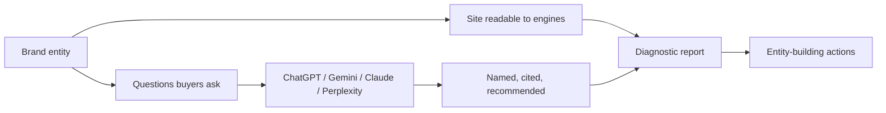

# MagUp GEO Report

> Languages: [English](README.md) | [简体中文](docs/readme/README_zh.md) | [Português](docs/readme/README_pt.md) | [Português (BR)](docs/readme/README_pt_BR.md) | [日本語](docs/readme/README_ja.md)

> Open-source GEO tooling for brand entity building

MagUp GEO Report helps you build the brand as an entity inside AI answers: the official site is readable to generative engines, and buyer questions name, cite, and recommend you correctly.

**MagUp GEO Report** is this GitHub project ([magnetx-ai/GEOReport](https://github.com/magnetx-ai/GEOReport), package `magup-geo-report`): an open-source generator you run locally. **MagUp** is the GEO platform at [magup.ai](https://magup.ai), from the same publisher ([magnetx-ai](https://github.com/magnetx-ai)). Same team; two products.

| | MagUp GEO Report | MagUp hosted |
| --- | --- | --- |
| Where | This repository | [magup.ai](https://magup.ai) |
| How you run it | `./start.sh` on your machine | [Generate a free GEO report](https://console.magup.ai/survey?templateId=6a478e309d2f99db4ce05590) |

[Quick start](#quick-start) · [Hosted report](#hosted-report) · [Why a GEO report](#why-you-need-a-geo-report) · [Interface preview](#interface-preview) · [Core capabilities](#core-capabilities) · [Where it fits](#where-it-fits) · [Website](https://magup.ai)

[](https://github.com/magnetx-ai/GEOReport)
[](https://www.python.org/)
[](LICENSE)
[](https://github.com/magnetx-ai/GEOReport/stargazers)

---

## What MagUp GEO Report is built to solve

AI answers are becoming the brand gateway. If the brand is not yet a clear, citable, recommendable entity, models give that slot to competitors.

This repository puts entity-building diagnosis on one machine:



One run shows how the brand appears as an entity across models, and which site and content signals to strengthen next.

---

## Why you need a GEO report

More buyers ask AI before they pick a brand. Generative answers cite only a handful of sources, and the recommendation shortlist is even shorter. If the brand is not yet a clear, citable, recommendable entity, that slot goes to a competitor.

A GEO report turns “how AI talks about you today” into a checkable diagnosis, so brand entity building follows evidence rather than guesswork.

### What the report does

- **Tests the entity**: whether AI describes the brand accurately, names it, and cites the official site.
- **Measures recommendation**: on unbranded category questions, who enters the shortlist — you or a competitor.
- **Compares models**: the same prompt set across ChatGPT, Gemini, Claude, and Perplexity.
- **Reads structure and sources**: whether the official site is readable to generative engines, and whether external footprints support citation.
- **Points to next actions**: a prioritized list of entity signals and content work.

### Why MagUp’s report

| Strength | How it shows up in the report |
| --- | --- |
| Objective | Findings come from this run’s harvested answers and site crawl; each claim maps back to evidence |
| Accurate | Branded and unbranded scenarios are counted separately; mention, citation, recommendation, and sentiment are tracked on their own |
| Consistent | Every model receives the same prompts, so platform gaps share one measurement method |
| Traceable | Raw answers and the prompt × platform matrix stay in the report, so numbers can be checked against the original text |
| Actionable | Gaps map to site structure, citable content, and source work — the moves that build the entity |

---

## Interface preview

<table>
  <tr>
    <td width="50%"><br /><sub>Report workspace</sub></td>
    <td width="50%"><br /><sub>Prompt builder</sub></td>
  </tr>
  <tr>
    <td width="50%"><br /><sub>Diagnostic cover</sub></td>
    <td width="50%"><br /><sub>Visibility overview</sub></td>
  </tr>
  <tr>
    <td width="50%"><br /><sub>Platform performance</sub></td>
    <td width="50%"><br /><sub>Channel diagnostics</sub></td>
  </tr>
</table>

The local UI covers brand intake, report language, platform selection, and prompt generation. The HTML dashboard covers cover KPIs, branded vs unbranded visibility, sentiment, platform gaps, source authority, competitor pressure, on-site GEO audit, and a prioritized action list.

---

## Core capabilities

| Capability | What a run produces |
| --- | --- |
| On-site GEO audit | Homepage fetch, `robots.txt`, AI crawler groups (GPTBot, ClaudeBot, PerplexityBot, and others), `llms.txt` / `ai.txt`, sitemap, JSON-LD types, title / H1 / meta, semantic landmarks |
| Prompt scenarios | Branded and category questions that test whether the entity is understood and recommended |
| Multi-model answers | Same prompt set across ChatGPT, Gemini, Claude, and Perplexity |
| Visibility analysis | Brand mention, official-site citation, competitor takeover, recommendation language, sentiment mix, category ranking |
| Diagnostic dashboard | Cover narrative, KPI tiles, radar and channel scores, prompt × platform matrix, raw answers, and effort-banded recommendations |
| Off-site signals | YouTube, Reddit, Wikipedia, and backlink summary when DataForSEO credentials are set |
| Local workspace | Enter the brand, generate the HTML dashboard; Cursor / Claude can continue from the Agent Skill |

Report languages: English, Simplified Chinese, Portuguese (PT / BR), French, Arabic, Japanese.

---

## Where it fits

| Scenario | Suggested setup | Focus |
| --- | --- | --- |
| Brand entity baseline | Official URL + brand name, then generate | Whether AI treats you as a recognizable, citable entity |
| Category recommendation | Add competitors and generate | Who occupies the entity slot on unbranded questions |
| Multilingual markets | Pick a report language, then generate | The same entity diagnosis in zh / en / pt / ja and more |
| Skip local setup | [Hosted GEO report](#hosted-report) | Same diagnosis, without installing Python, keys, or a local server |

---

## Runtime

| Piece | Requirement |
| --- | --- |
| Python | 3.10 or later |
| Start | `./start.sh` |
| OS | macOS, Linux, or Windows via Git Bash / WSL |

Optional: copy [`env.example`](env.example) to `.env` to pull live answers.

---

## Quick start

```bash
git clone https://github.com/magnetx-ai/GEOReport.git
cd GEOReport
./start.sh
```

The script installs dependencies and opens [http://127.0.0.1:8787](http://127.0.0.1:8787). Enter the official site and brand name, generate prompts, then click **Generate report**.

On Windows, run the same script from Git Bash or WSL.

---

## Hosted report

This project is the core generator for analyzing AI search visibility. If you would rather run a full GEO analysis without setting up the environment locally, MagUp can generate a free hosted report and walk through the findings with you.

[Generate a free GEO report](https://console.magup.ai/survey?templateId=6a478e309d2f99db4ce05590)

---

## Developer entry points

Clone this repository and open [`skills/magup-geo-report/SKILL.md`](skills/magup-geo-report/SKILL.md). Cursor and Claude Code will pick it up from the repo.

---

## License

Apache License 2.0. See [LICENSE](LICENSE).

---

## Other languages

- [简体中文](docs/readme/README_zh.md)
- [Português](docs/readme/README_pt.md)
- [Português (BR)](docs/readme/README_pt_BR.md)
- [日本語](docs/readme/README_ja.md)

Product: **MagUp** · Site: [https://magup.ai](https://magup.ai) · Code: [https://github.com/magnetx-ai/GEOReport](https://github.com/magnetx-ai/GEOReport)

---

## Star history

[](https://star-history.dera.page/#magnetx-ai/GEOReport&Date)
