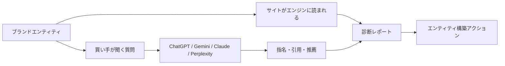
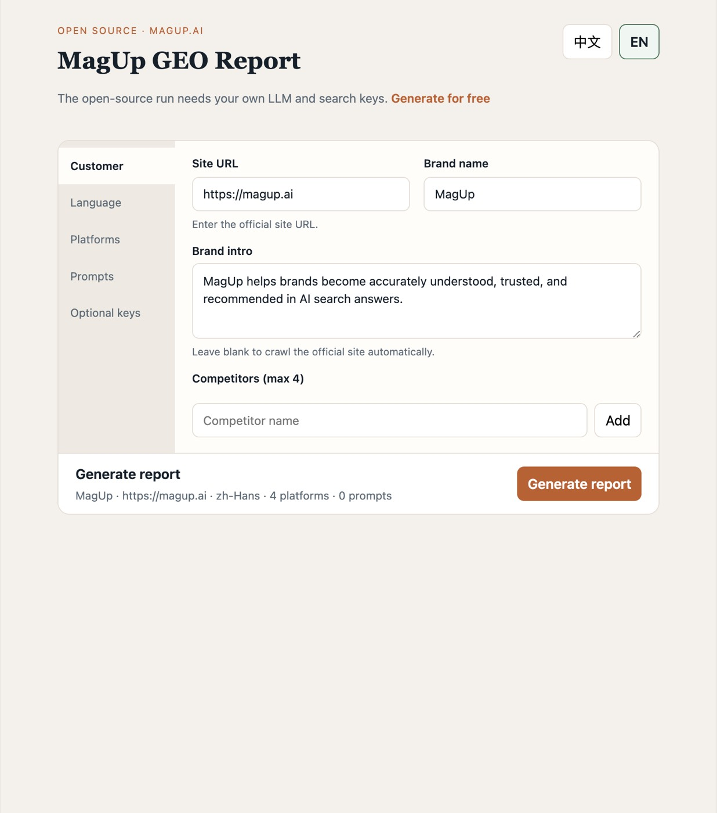
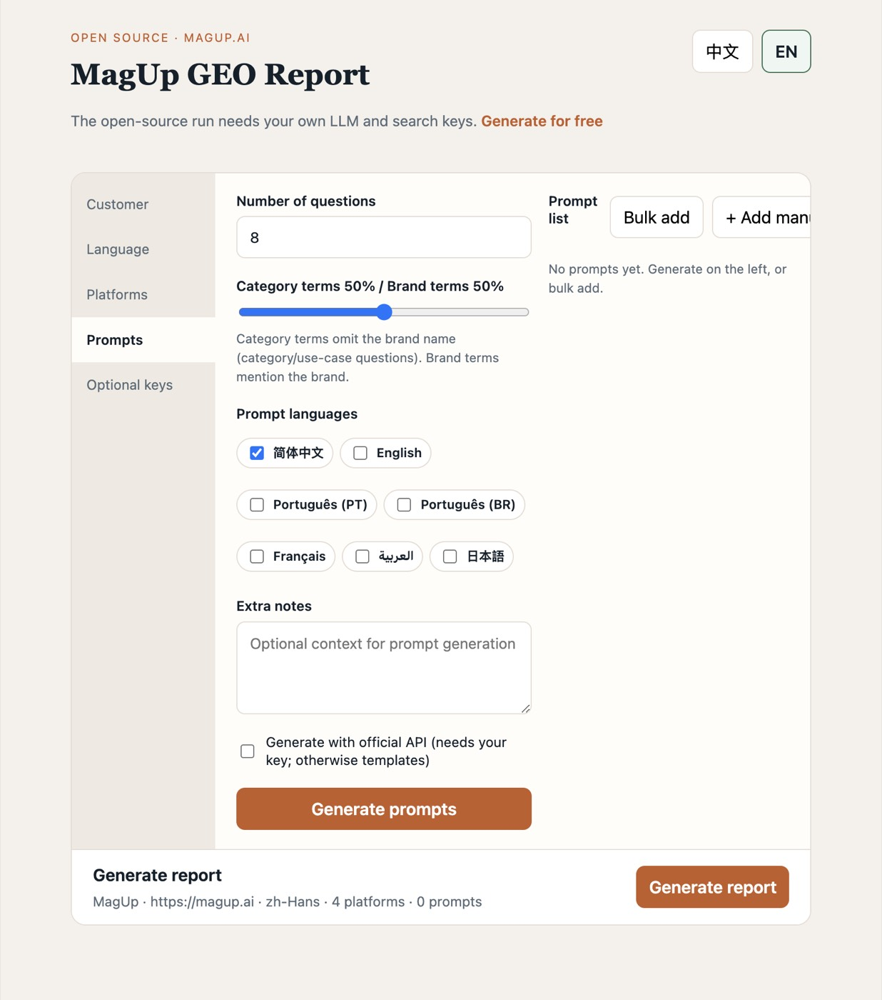
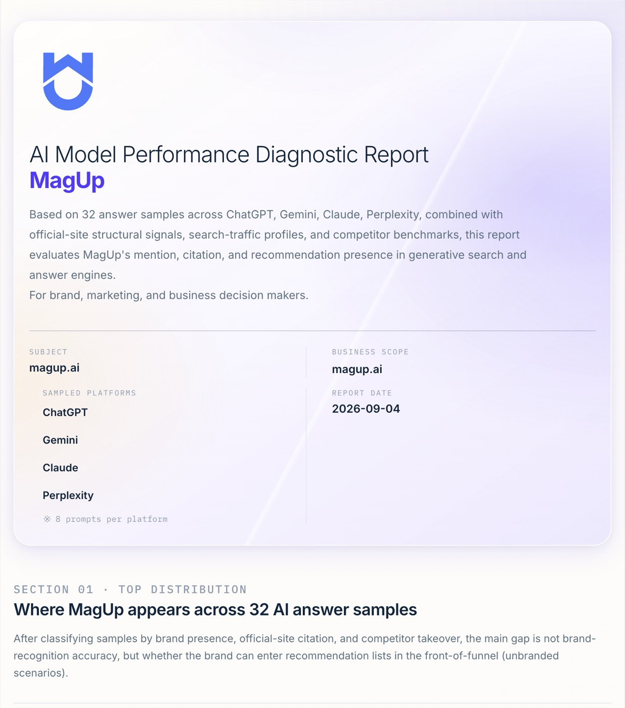
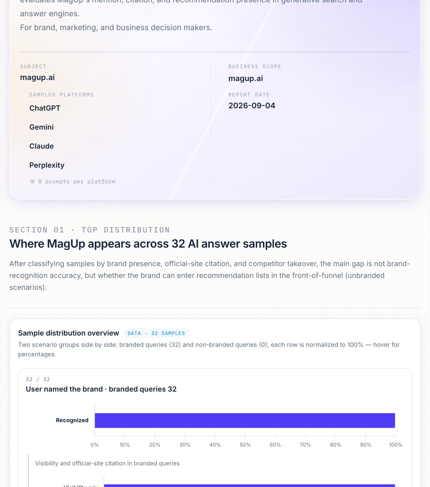
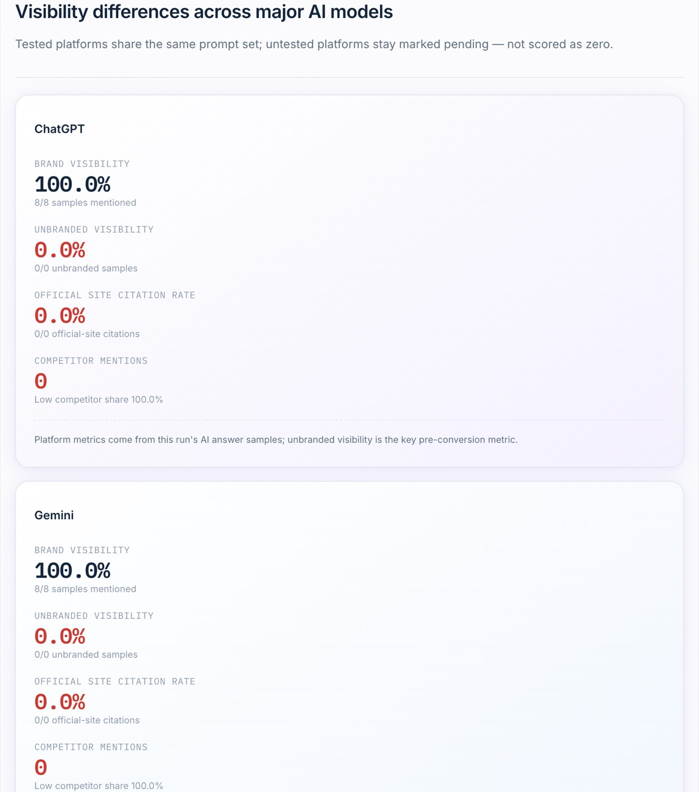
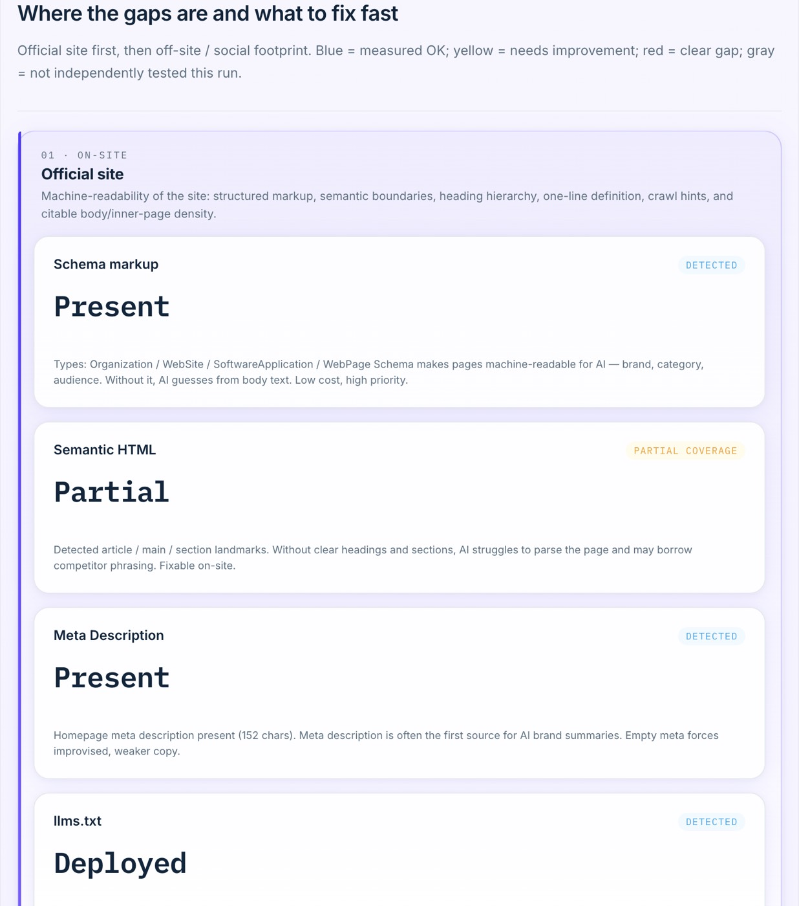

# MagUp GEO Report

> 言語: [English](../../README.md) | [简体中文](README_zh.md) | [Português](README_pt.md) | [Português (BR)](README_pt_BR.md) | [日本語](README_ja.md)

> ブランドエンティティ構築のためのオープンソース GEO ツール

MagUp GEO Report は、AI 回答の中でブランドを実体として育てるためのものです。公式サイトが生成エンジンに読まれ、購入検討の質問で正しく指名・引用・推薦されるようにします。

セットアップを自分でやりたくない場合は、[magup.ai](https://magup.ai) を開き、**[Get Plan](https://console.magup.ai/survey?templateId=6a478e309d2f99db4ce05590)** をクリックしてブランドの基本情報を入力してください。MagUp が診断レポートを無料で生成し、結果を一緒に読み解きます。

[クイックスタート](#クイックスタート) · [なぜ GEO レポートが必要か](#なぜ-geo-レポートが必要か) · [画面プレビュー](#画面プレビュー) · [コア機能](#コア機能) · [適した場面](#適した場面) · [公式サイト](https://magup.ai)

[](https://github.com/magnetx-ai/MagUp-Geo-Report)
[](https://www.python.org/)
[](../../LICENSE)
[](https://github.com/magnetx-ai/MagUp-Geo-Report/stargazers)

---

## MagUp GEO Report が解く課題

AI 回答はブランドの入口になりつつあります。ブランドがまだ明確で、引用でき、推薦できるエンティティでなければ、その枠は競合に渡ります。

このリポジトリはエンティティ構築の診断を 1 台のマシンにまとめます。



1 回の実行で、各モデルにおけるブランドの実体としての現れ方と、次に強めるべきサイト／コンテンツ信号が分かります。

---

## なぜ GEO レポートが必要か

購入検討者は、ブランドを選ぶ前に AI に聞くことが増えています。生成回答が引用するソースは少数で、推薦リストはさらに短い。ブランドがまだ明確で、引用でき、推薦できるエンティティでなければ、その枠は競合に渡ります。

GEO レポートは「今、AI があなたをどう語るか」を照合可能な診断にし、ブランドエンティティ構築を感覚ではなく証拠で進めます。

### レポートでできること

- **エンティティの成立を見る**：AI がブランドを正確に説明し、指名し、公式サイトを引用できるか。
- **推薦枠を測る**：ブランド名のないカテゴリ質問で、ショートリストに入るのは自社か競合か。
- **モデル差を比べる**：同じプロンプトセットで ChatGPT、Gemini、Claude、Perplexity を対照。
- **構造とソースを読む**：公式サイトが生成エンジンに読めるか、外部フットプリントが引用を支えるか。
- **次の一手を示す**：優先度付きのエンティティ信号とコンテンツ施策。

### MagUp レポートの強み

| 強み | レポートでの現れ方 |
| --- | --- |
| 客観 | 結論は本ラウンドで取得した回答とサイトクロールに基づき、各項目を証拠に戻せる |
| 正確 | ブランドあり / なしを分けて集計。言及、引用、推薦、センチメントを個別に数える |
| 口径が揃う | 各モデルに同じプロンプトを渡し、プラットフォーム差は同一の測定方法から出る |
| 追跡できる | 生回答とプロンプト × プラットフォーム行列が残り、数字を原文で確認できる |
| 実行できる | ギャップはサイト構造、引用可能なコンテンツ、ソース施策に対応し、エンティティ構築につながる |

---

## 画面プレビュー

<table>
  <tr>
    <td width="50%"><br /><sub>レポートワークスペース</sub></td>
    <td width="50%"><br /><sub>プロンプト生成</sub></td>
  </tr>
  <tr>
    <td width="50%"><br /><sub>診断カバー</sub></td>
    <td width="50%"><br /><sub>可視性オーバービュー</sub></td>
  </tr>
  <tr>
    <td width="50%"><br /><sub>プラットフォーム性能</sub></td>
    <td width="50%"><br /><sub>チャネル診断</sub></td>
  </tr>
</table>

ローカル UI はブランド情報、レポート言語、プラットフォーム選択、プロンプト生成をカバーします。HTML ダッシュボードはカバー KPI、ブランドあり / なしの可視性、センチメント、プラットフォーム差、ソース権威、競合プレッシャー、サイト GEO 診断、工数目安付きのアクションリストをカバーします。

---

## コア機能

| 機能 | 1 回の実行で得られるもの |
| --- | --- |
| サイト GEO 診断 | ホームページ取得、`robots.txt`、AI クローラグループ（GPTBot、ClaudeBot、PerplexityBot など）、`llms.txt` / `ai.txt`、sitemap、JSON-LD 型、title / H1 / meta、セマンティックランドマーク |
| プロンプトシナリオ | ブランド精度とカテゴリ発見の質問で、エンティティが正しく理解・推薦されるかを検証 |
| マルチモデル回答 | 同じプロンプトセットで ChatGPT、Gemini、Claude、Perplexity をカバー |
| 可視性分析 | ブランド言及、公式サイト引用、競合による奪取、推薦表現、センチメント構成、カテゴリ順位 |
| 診断ダッシュボード | カバーナラティブ、KPI、レーダーとチャネルスコア、プロンプト × プラットフォーム行列、生回答、工数帯別の推奨 |
| オフサイト信号 | DataForSEO 資格情報がある場合、YouTube、Reddit、Wikipedia、被リンク要約 |
| ローカルワークスペース | ブランドを入力して HTML ダッシュボードを生成。Cursor / Claude は Agent Skill から続けられる |

レポート言語: 英語、簡体字中国語、ポルトガル語（PT / BR）、フランス語、アラビア語、日本語。

---

## 適した場面

| 場面 | 推奨セットアップ | 焦点 |
| --- | --- | --- |
| ブランドエンティティの現状 | 公式 URL とブランド名を入れて生成 | AI が識別・引用できる実体として扱っているか |
| カテゴリ推薦枠 | 競合を入れて生成 | ブランドなし質問で誰がその枠を占めるか |
| 多言語市場 | レポート言語を選んで生成 | zh / en / pt / ja などで同じエンティティ診断 |
| MagUp に任せる | [magup.ai](https://magup.ai) で [Get Plan](https://console.magup.ai/survey?templateId=6a478e309d2f99db4ce05590) | MagUp がレポートを生成し、一緒に読み解く |

---

## 実行環境

| 構成 | 要件 |
| --- | --- |
| Python | 3.10 以降 |
| 起動 | `./start.sh` |
| OS | macOS、Linux、または Git Bash / WSL 経由の Windows |

任意: ライブ回答を取る場合は [`env.example`](../../env.example) を `.env` にコピーします。

---

## クイックスタート

```bash
git clone https://github.com/magnetx-ai/MagUp-Geo-Report.git
cd MagUp-Geo-Report
./start.sh
```

スクリプトが依存関係を入れ、[http://127.0.0.1:8787](http://127.0.0.1:8787) を開きます。公式サイトとブランド名を入力し、プロンプトを生成して **Generate report** をクリックしてください。

Windows では Git Bash または WSL で同じスクリプトを実行します。

---

## 開発者向け入口

このリポジトリをクローンし、[`skills/magup-geo-report/SKILL.md`](../../skills/magup-geo-report/SKILL.md) を開きます。Cursor と Claude Code はリポジトリから検出します。

---

## ライセンス

Apache License 2.0。[LICENSE](../../LICENSE) を参照してください。

---

## その他の言語

- [English](../../README.md)
- [简体中文](README_zh.md)
- [Português](README_pt.md)
- [Português (BR)](README_pt_BR.md)

プロダクト: **MagUp** · サイト: [https://magup.ai](https://magup.ai) · コード: [https://github.com/magnetx-ai/MagUp-Geo-Report](https://github.com/magnetx-ai/MagUp-Geo-Report)

---

## Star 推移

[](https://star-history.dera.page/#magnetx-ai/MagUp-Geo-Report&Date)
