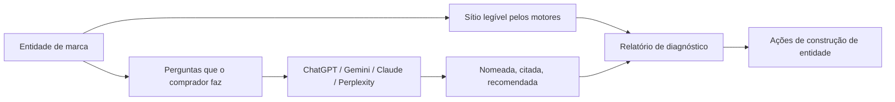

# MagUp GEO Report

> Línguas: [English](../../README.md) | [简体中文](README_zh.md) | [Português](README_pt.md) | [Português (BR)](README_pt_BR.md) | [日本語](README_ja.md)

> Ferramenta GEO de código aberto para construção da entidade de marca

O MagUp GEO Report serve para construir a marca como entidade nas respostas de IA: o sítio oficial torna-se legível para motores generativos, e as perguntas de compra passam a nomear, citar e recomendar a marca corretamente.

Prefere que a MagUp execute o diagnóstico e o explique consigo? Abra [magup.ai](https://magup.ai), clique em **[Get Plan](https://console.magup.ai/survey?templateId=6a478e309d2f99db4ce05590)**, indique alguns dados da marca e a equipa gera o relatório e faz a leitura consigo — sem custos.

[Início rápido](#início-rápido) · [Porque precisa de um relatório GEO](#porque-precisa-de-um-relatório-geo) · [Pré-visualização](#pré-visualização-da-interface) · [Capacidades](#capacidades-principais) · [Onde se enquadra](#onde-se-enquadra) · [Sítio](https://magup.ai)

[](https://github.com/magnetx-ai/MagUp-Geo-Report)
[](https://www.python.org/)
[](../../LICENSE)
[](https://github.com/magnetx-ai/MagUp-Geo-Report/stargazers)

---

## O problema que o MagUp GEO Report resolve

As respostas de IA estão a tornar-se a porta de entrada da marca. Se a marca ainda não for uma entidade clara, citável e recomendável, os modelos dão esse lugar aos concorrentes.

Este repositório junta o diagnóstico de construção de entidade numa só máquina:



Uma execução mostra como a marca aparece como entidade em cada modelo, e que sinais de sítio e conteúdo reforçar a seguir.

---

## Porque precisa de um relatório GEO

Cada vez mais compradores perguntam à IA antes de escolher uma marca. As respostas generativas citam poucas fontes, e a lista de recomendações é ainda mais curta. Se a marca ainda não for uma entidade clara, citável e recomendável, esse lugar vai para um concorrente.

Um relatório GEO transforma «como a IA fala de si hoje» num diagnóstico verificável, para a construção da entidade seguir evidência e não palpite.

### O que o relatório faz

- **Testa a entidade**: se a IA descreve a marca com rigor, a nomeia e cita o sítio oficial.
- **Mede a recomendação**: em perguntas de categoria sem nome de marca, quem entra na shortlist — a sua marca ou um concorrente.
- **Compara modelos**: o mesmo conjunto de prompts em ChatGPT, Gemini, Claude e Perplexity.
- **Lê estrutura e fontes**: se o sítio oficial é legível para motores generativos, e se o rasto externo sustenta a citação.
- **Indica o próximo passo**: uma lista priorizada de sinais de entidade e trabalho de conteúdo.

### Porque o relatório MagUp

| Força | Como aparece no relatório |
| --- | --- |
| Objetivo | As conclusões vêm das respostas colhidas nesta execução e do crawl do sítio; cada ponto volta à evidência |
| Preciso | Cenários com e sem marca são contados em separado; menção, citação, recomendação e sentimento têm contagens próprias |
| Consistente | Todos os modelos recebem os mesmos prompts, pelo que as diferenças entre plataformas partilham um método de medição |
| Rastreável | As respostas originais e a matriz prompt × plataforma ficam no relatório, para os números se poderem confirmar no texto |
| Acionável | As lacunas mapeiam para estrutura do sítio, conteúdo citável e trabalho de fontes — os passos que constroem a entidade |

---

## Pré-visualização da interface

<table>
  <tr>
    <td width="50%"><br /><sub>Área de trabalho</sub></td>
    <td width="50%"><br /><sub>Gerador de prompts</sub></td>
  </tr>
  <tr>
    <td width="50%"><br /><sub>Capa do diagnóstico</sub></td>
    <td width="50%"><br /><sub>Visão geral de visibilidade</sub></td>
  </tr>
  <tr>
    <td width="50%"><br /><sub>Desempenho por plataforma</sub></td>
    <td width="50%"><br /><sub>Diagnóstico de canais</sub></td>
  </tr>
</table>

A interface local cobre dados da marca, língua do relatório, escolha de plataformas e geração de prompts. O painel HTML cobre KPIs de capa, visibilidade com e sem marca, sentimento, diferenças entre plataformas, autoridade de fontes, pressão da concorrência, auditoria GEO do sítio e ações ordenadas por esforço.

---

## Capacidades principais

| Capacidade | O que uma execução produz |
| --- | --- |
| Auditoria GEO do sítio | Pedido da homepage, `robots.txt`, grupos de crawlers de IA (GPTBot, ClaudeBot, PerplexityBot e outros), `llms.txt` / `ai.txt`, sitemap, tipos JSON-LD, title / H1 / meta, marcos semânticos |
| Cenários de prompts | Perguntas de precisão da marca e de categoria, para ver se a entidade é compreendida e recomendada |
| Respostas multi-modelo | O mesmo conjunto de prompts em ChatGPT, Gemini, Claude e Perplexity |
| Análise de visibilidade | Menção da marca, citação do sítio oficial, ocupação por concorrentes, linguagem de recomendação, mistura de sentimento, ranking na categoria |
| Painel de diagnóstico | Narrativa de capa, KPIs, radar e pontuações de canal, matriz prompt × plataforma, respostas originais e recomendações por faixa de esforço |
| Sinais off-site | YouTube, Reddit, Wikipedia e resumo de backlinks quando as credenciais DataForSEO estão definidas |
| Área de trabalho local | Indique a marca e gere o painel HTML; o Cursor / Claude pode continuar a partir do Agent Skill |

Línguas do relatório: inglês, chinês simplificado, português (PT / BR), francês, árabe, japonês.

---

## Onde se enquadra

| Cenário | Configuração sugerida | Foco |
| --- | --- | --- |
| Linha de base da entidade | URL oficial + nome da marca | Se a IA a trata como entidade reconhecível e citável |
| Recomendação de categoria | Adicione concorrentes e gere | Quem ocupa o lugar da entidade em perguntas sem marca |
| Mercados multilingues | Escolha a língua do relatório e gere | O mesmo diagnóstico de entidade em zh / en / pt / ja e outras |
| Diagnóstico feito pela MagUp | [Get Plan](https://console.magup.ai/survey?templateId=6a478e309d2f99db4ce05590) em [magup.ai](https://magup.ai) | A MagUp gera o relatório e interpreta-o consigo |

---

## Ambiente de execução

| Peça | Requisito |
| --- | --- |
| Python | 3.10 ou posterior |
| Arranque | `./start.sh` |
| Sistema | macOS, Linux, ou Windows via Git Bash / WSL |

Opcional: copie [`env.example`](../../env.example) para `.env` para obter respostas em direto.

---

## Início rápido

```bash
git clone https://github.com/magnetx-ai/MagUp-Geo-Report.git
cd MagUp-Geo-Report
./start.sh
```

O script instala as dependências e abre [http://127.0.0.1:8787](http://127.0.0.1:8787). Indique o sítio oficial e o nome da marca, gere os prompts e clique em **Generate report**.

No Windows, execute o mesmo script no Git Bash ou no WSL.

---

## Entradas para programadores

Clone este repositório e abra [`skills/magup-geo-report/SKILL.md`](../../skills/magup-geo-report/SKILL.md). O Cursor e o Claude Code detetam-no a partir do repositório.

---

## Licença

Apache License 2.0. Ver [LICENSE](../../LICENSE).

---

## Outras línguas

- [English](../../README.md)
- [简体中文](README_zh.md)
- [Português (BR)](README_pt_BR.md)
- [日本語](README_ja.md)

Produto: **MagUp** · Sítio: [https://magup.ai](https://magup.ai) · Código: [https://github.com/magnetx-ai/MagUp-Geo-Report](https://github.com/magnetx-ai/MagUp-Geo-Report)

---

## Histórico de stars

[](https://star-history.dera.page/#magnetx-ai/MagUp-Geo-Report&Date)
