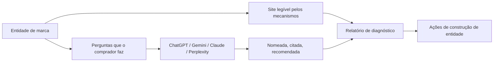

# MagUp GEO Report

> Idiomas: [English](../../README.md) | [简体中文](README_zh.md) | [Português](README_pt.md) | [Português (BR)](README_pt_BR.md) | [日本語](README_ja.md)

> Ferramenta GEO open source para construção da entidade de marca

O MagUp GEO Report serve para construir a marca como entidade nas respostas de IA: o site oficial fica legível para mecanismos generativos, e as perguntas de compra passam a nomear, citar e recomendar a marca corretamente.

**MagUp GEO Report** é este projeto no GitHub ([magnetx-ai/GEOReport](https://github.com/magnetx-ai/GEOReport), pacote `magup-geo-report`): um gerador open source que roda na sua máquina. **MagUp** é a plataforma GEO em [magup.ai](https://magup.ai), da mesma entidade publicadora ([magnetx-ai](https://github.com/magnetx-ai)). O mesmo time; dois produtos.

| | MagUp GEO Report | MagUp hospedado |
| --- | --- | --- |
| Onde | Este repositório | [magup.ai](https://magup.ai) |
| Como rodar | `./start.sh` localmente | [Gerar um relatório GEO gratuito](https://console.magup.ai/survey?templateId=6a478e309d2f99db4ce05590) |

[Início rápido](#início-rápido) · [Relatório hospedado](#relatório-hospedado) · [Por que você precisa de um relatório GEO](#por-que-você-precisa-de-um-relatório-geo) · [Prévia da interface](#prévia-da-interface) · [Capacidades](#capacidades-principais) · [Onde encaixa](#onde-encaixa) · [Site](https://magup.ai)

[](https://github.com/magnetx-ai/GEOReport)
[](https://www.python.org/)
[](../../LICENSE)
[](https://github.com/magnetx-ai/GEOReport/stargazers)

---

## O problema que o MagUp GEO Report resolve

As respostas de IA estão se tornando a porta de entrada da marca. Se a marca ainda não for uma entidade clara, citável e recomendável, os modelos dão esse lugar aos concorrentes.

Este repositório junta o diagnóstico de construção de entidade em uma só máquina:



Uma execução mostra como a marca aparece como entidade em cada modelo, e quais sinais de site e conteúdo fortalecer em seguida.

---

## Por que você precisa de um relatório GEO

Cada vez mais compradores perguntam à IA antes de escolher uma marca. Respostas generativas citam poucas fontes, e a lista de recomendações é ainda mais curta. Se a marca ainda não for uma entidade clara, citável e recomendável, esse lugar vai para um concorrente.

Um relatório GEO transforma “como a IA fala de você hoje” em um diagnóstico verificável, para a construção da entidade seguir evidência — e não palpite.

### O que o relatório faz

- **Testa a entidade**: se a IA descreve a marca com precisão, cita o nome e aponta o site oficial.
- **Mede a recomendação**: em perguntas de categoria sem o nome da marca, quem entra na shortlist — você ou um concorrente.
- **Compara modelos**: o mesmo conjunto de prompts em ChatGPT, Gemini, Claude e Perplexity.
- **Lê estrutura e fontes**: se o site oficial é legível para mecanismos generativos, e se o rastro externo sustenta a citação.
- **Indica o próximo passo**: uma lista priorizada de sinais de entidade e trabalho de conteúdo.

### Por que o relatório MagUp

| Força | Como aparece no relatório |
| --- | --- |
| Objetivo | As conclusões vêm das respostas coletadas nesta execução e do crawl do site; cada ponto volta à evidência |
| Preciso | Cenários com e sem marca são contados em separado; menção, citação, recomendação e sentimento têm contagens próprias |
| Consistente | Todos os modelos recebem os mesmos prompts, então as diferenças entre plataformas compartilham um método de medição |
| Rastreável | As respostas originais e a matriz prompt × plataforma ficam no relatório, para os números poderem ser conferidos no texto |
| Acionável | As lacunas mapeiam para estrutura do site, conteúdo citável e trabalho de fontes — os passos que constroem a entidade |

---

## Prévia da interface

<table>
  <tr>
    <td width="50%"><br /><sub>Workspace do relatório</sub></td>
    <td width="50%"><br /><sub>Gerador de prompts</sub></td>
  </tr>
  <tr>
    <td width="50%"><br /><sub>Capa do diagnóstico</sub></td>
    <td width="50%"><br /><sub>Visão geral de visibilidade</sub></td>
  </tr>
  <tr>
    <td width="50%"><br /><sub>Desempenho por plataforma</sub></td>
    <td width="50%"><br /><sub>Diagnóstico de canais</sub></td>
  </tr>
</table>

A interface local cobre dados da marca, idioma do relatório, escolha de plataformas e geração de prompts. O dashboard HTML cobre KPIs de capa, visibilidade com e sem marca, sentimento, diferenças entre plataformas, autoridade de fontes, pressão de concorrentes, auditoria GEO do site e ações ordenadas por esforço.

---

## Capacidades principais

| Capacidade | O que uma execução produz |
| --- | --- |
| Auditoria GEO do site | Fetch da homepage, `robots.txt`, grupos de crawlers de IA (GPTBot, ClaudeBot, PerplexityBot e outros), `llms.txt` / `ai.txt`, sitemap, tipos JSON-LD, title / H1 / meta, marcos semânticos |
| Cenários de prompts | Perguntas de precisão da marca e de categoria, para ver se a entidade é compreendida e recomendada |
| Respostas multi-modelo | O mesmo conjunto de prompts em ChatGPT, Gemini, Claude e Perplexity |
| Análise de visibilidade | Menção da marca, citação do site oficial, takeover de concorrentes, linguagem de recomendação, mix de sentimento, ranking na categoria |
| Dashboard de diagnóstico | Narrativa de capa, KPIs, radar e scores de canal, matriz prompt × plataforma, respostas brutas e recomendações por faixa de esforço |
| Sinais off-site | YouTube, Reddit, Wikipedia e resumo de backlinks quando as credenciais DataForSEO estão configuradas |
| Workspace local | Informe a marca e gere o dashboard HTML; Cursor / Claude podem continuar a partir do Agent Skill |

Idiomas do relatório: inglês, chinês simplificado, português (PT / BR), francês, árabe, japonês.

---

## Onde encaixa

| Cenário | Setup sugerido | Foco |
| --- | --- | --- |
| Baseline da entidade | URL oficial + nome da marca | Se a IA trata você como entidade reconhecível e citável |
| Recomendação de categoria | Adicione concorrentes e gere | Quem ocupa o lugar da entidade em perguntas sem marca |
| Mercados multilíngues | Escolha o idioma do relatório e gere | O mesmo diagnóstico de entidade em zh / en / pt / ja e outros |
| Sem instalação local | [Relatório hospedado](#relatório-hospedado) | O mesmo diagnóstico, sem Python, chaves nem servidor local |

---

## Ambiente de execução

| Peça | Requisito |
| --- | --- |
| Python | 3.10 ou posterior |
| Inicialização | `./start.sh` |
| Sistema | macOS, Linux, ou Windows via Git Bash / WSL |

Opcional: copie [`env.example`](../../env.example) para `.env` para puxar respostas ao vivo.

---

## Início rápido

```bash
git clone https://github.com/magnetx-ai/GEOReport.git
cd GEOReport
./start.sh
```

O script instala as dependências e abre [http://127.0.0.1:8787](http://127.0.0.1:8787). Informe o site oficial e o nome da marca, gere os prompts e clique em **Generate report**.

No Windows, rode o mesmo script no Git Bash ou no WSL.

---

## Relatório hospedado

Este projeto fornece a funcionalidade central para analisar a visibilidade em busca de IA. Se preferir uma análise GEO completa sem configurar o ambiente localmente, use a versão hospedada para gerar um relatório gratuito. A MagUp explica os resultados com você.

[Gerar um relatório GEO gratuito](https://console.magup.ai/survey?templateId=6a478e309d2f99db4ce05590)

---

## Entradas para desenvolvedores

Clone este repositório e abra [`skills/magup-geo-report/SKILL.md`](../../skills/magup-geo-report/SKILL.md). Cursor e Claude Code descobrem o skill a partir do repositório.

---

## Licença

Apache License 2.0. Veja [LICENSE](../../LICENSE).

---

## Outros idiomas

- [English](../../README.md)
- [简体中文](README_zh.md)
- [Português](README_pt.md)
- [日本語](README_ja.md)

Produto: **MagUp** · Site: [https://magup.ai](https://magup.ai) · Código: [https://github.com/magnetx-ai/GEOReport](https://github.com/magnetx-ai/GEOReport)

---

## Histórico de stars

[](https://star-history.dera.page/#magnetx-ai/GEOReport&Date)
