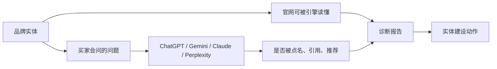

# MagUp GEO Report

> 语言：[English](../../README.md) | [简体中文](README_zh.md) | [Português](README_pt.md) | [Português (BR)](README_pt_BR.md) | [日本語](README_ja.md)

> 面向品牌实体建设的开源 GEO 工具

MagUp GEO Report 用来建设品牌在 AI 回答里的实体存在：让官网能被生成式引擎读懂，让买家问题里能被正确点名、引用和推荐。

**MagUp GEO Report** 是本 GitHub 项目（[magnetx-ai/GEOReport](https://github.com/magnetx-ai/GEOReport)，包名 `magup-geo-report`）：开源、在本地运行的生成器。**MagUp** 是同一出品方（[magnetx-ai](https://github.com/magnetx-ai)）在 [magup.ai](https://magup.ai) 的 GEO 平台。同一个团队，两款产品。

| | MagUp GEO Report | MagUp 托管版 |
| --- | --- | --- |
| 在哪 | 本仓库 | [magup.ai](https://magup.ai) |
| 怎么跑 | 本机执行 `./start.sh` | [生成免费 GEO 报告](https://console.magup.ai/survey?templateId=6a478e309d2f99db4ce05590) |

[快速开始](#快速开始) · [托管报告](#托管报告) · [为什么需要 GEO 报告](#为什么需要-geo-报告) · [界面预览](#界面预览) · [核心能力](#核心能力) · [适用场景](#适用场景) · [官网](https://magup.ai)

[](https://github.com/magnetx-ai/GEOReport)
[](https://www.python.org/)
[](../../LICENSE)
[](https://github.com/magnetx-ai/GEOReport/stargazers)

---

## MagUp GEO Report 解决什么问题

AI 回答正在成为品牌入口。如果品牌还不是一个清晰、可引用、可推荐的实体，模型会把位置让给竞品。

本仓库把实体建设的诊断放进同一台机器：



一次运行会给出品牌在各模型里的实体表现，以及下一步该补哪些官网与内容信号。

---

## 为什么需要 GEO 报告

买家越来越多地先问 AI，再决定看哪个品牌。生成式回答通常只引用少数来源，推荐名单更短。品牌如果还不是一个清晰、可引用、可推荐的实体，那个位置就会让给竞品。

GEO 报告把「AI 现在怎么说你」变成一份可核对的诊断，用来指导品牌实体建设，而不是凭感觉改内容。

### 报告能做什么

- **看实体是否成立**：AI 能否准确描述品牌、点名品牌、引用官网。
- **看推荐位**：在未点名品牌的品类问题里，进入短名单的是你还是竞品。
- **看模型差异**：同一组问题对照 ChatGPT、Gemini、Claude、Perplexity。
- **看结构与信源**：官网是否对生成式引擎可读，外部足迹是否支撑引用。
- **给出下一步**：按优先级列出该补的实体信号与内容动作。

### MagUp 报告的优势

| 优势 | 在报告里如何体现 |
| --- | --- |
| 客观 | 结论来自本轮采集到的回答和官网抓取，每一项都能回到证据 |
| 准确 | 有品牌 / 无品牌场景分开统计；提及、引用、推荐、情感分别计数 |
| 口径一致 | 各模型使用同一组提示词，平台差异来自同一套测量方法 |
| 可追溯 | 保留原始回答和提示词 × 平台矩阵，数字可以核对到原文 |
| 可执行 | 缺口对应到官网结构、可引用内容和信源动作，直接服务实体建设 |

---

## 界面预览

<table>
  <tr>
    <td width="50%"><br /><sub>报告工作台</sub></td>
    <td width="50%"><br /><sub>提示词生成</sub></td>
  </tr>
  <tr>
    <td width="50%"><br /><sub>诊断封面</sub></td>
    <td width="50%"><br /><sub>可见性总览</sub></td>
  </tr>
  <tr>
    <td width="50%"><br /><sub>平台表现</sub></td>
    <td width="50%"><br /><sub>渠道诊断</sub></td>
  </tr>
</table>

本地界面覆盖品牌信息、报告语言、平台选择和提示词生成。HTML 仪表盘覆盖封面指标、有品牌 / 无品牌可见性、情感、平台差距、信源权威、竞品压力、官网 GEO 体检，以及按投入分级的行动清单。

---

## 核心能力

| 能力 | 一次运行产出 |
| --- | --- |
| 站点 GEO 体检 | 首页抓取、`robots.txt`、AI 爬虫分组（GPTBot、ClaudeBot、PerplexityBot 等）、`llms.txt` / `ai.txt`、sitemap、JSON-LD 类型、title / H1 / meta、语义结构 |
| 提示词场景 | 品牌准确性问题与品类发现类问题，用来检验实体是否被正确理解与推荐 |
| 多模型回答 | 同一组提示词覆盖 ChatGPT、Gemini、Claude、Perplexity |
| 可见性分析 | 品牌提及、官网引用、竞品接管、推荐话术、情感分布、品类排名 |
| 诊断仪表盘 | 封面叙事、KPI、雷达与渠道分、提示词 × 平台矩阵、原始回答、按投入分级的建议 |
| 站外信号 | 配置 DataForSEO 后采集 YouTube、Reddit、Wikipedia 与外链摘要 |
| 本地工作台 | 填写品牌后生成 HTML 仪表盘；Cursor / Claude 可通过 Agent Skill 接着做 |

报告语言：简体中文、英语、葡萄牙语（PT / BR）、法语、阿拉伯语、日语。

---

## 适用场景

| 场景 | 建议用法 | 重点 |
| --- | --- | --- |
| 品牌实体摸底 | 填写官网 URL 和品牌名后生成 | AI 是否把你当成可识别、可引用的实体 |
| 品类推荐位 | 带上竞品，看无品牌问题里谁被点名 | 漏斗前端的实体占位 |
| 多语言市场 | 选择报告语言后生成 | 同一套实体诊断覆盖中 / 英 / 葡 / 日等 |
| 不做本地部署 | [托管报告](#托管报告) | 同一套诊断，无需安装 Python、密钥或本地服务 |

---

## 运行环境

| 组件 | 要求 |
| --- | --- |
| Python | 3.10 及以上 |
| 启动 | `./start.sh` |
| 系统 | macOS、Linux，或 Windows 上的 Git Bash / WSL |

可选：把 [`env.example`](../../env.example) 复制为 `.env`，用于拉取实时回答。

---

## 快速开始

```bash
git clone https://github.com/magnetx-ai/GEOReport.git
cd GEOReport
./start.sh
```

脚本会安装依赖并打开 [http://127.0.0.1:8787](http://127.0.0.1:8787)。填写官网与品牌名，生成提示词，再点 **生成报告**。

Windows 请在 Git Bash 或 WSL 中运行同一脚本。

---

## 托管报告

本仓库提供 AI 搜索可见性分析的核心能力。如果希望不做本地环境配置、直接跑完整 GEO 诊断，可以使用托管版本，免费生成报告并由 MagUp 一起解读。

[生成免费 GEO 报告](https://console.magup.ai/survey?templateId=6a478e309d2f99db4ce05590)

---

## 开发者入口

克隆本仓库并打开 [`skills/magup-geo-report/SKILL.md`](../../skills/magup-geo-report/SKILL.md)。Cursor 与 Claude Code 会从仓库中发现它。

---

## 开源协议

Apache License 2.0，详见 [LICENSE](../../LICENSE)。

---

## 其他语言

- [English](../../README.md)
- [Português](README_pt.md)
- [Português (BR)](README_pt_BR.md)
- [日本語](README_ja.md)

产品：**MagUp** · 官网：[https://magup.ai](https://magup.ai) · 代码：[https://github.com/magnetx-ai/GEOReport](https://github.com/magnetx-ai/GEOReport)

---

## Star 趋势

[](https://star-history.dera.page/#magnetx-ai/GEOReport&Date)
